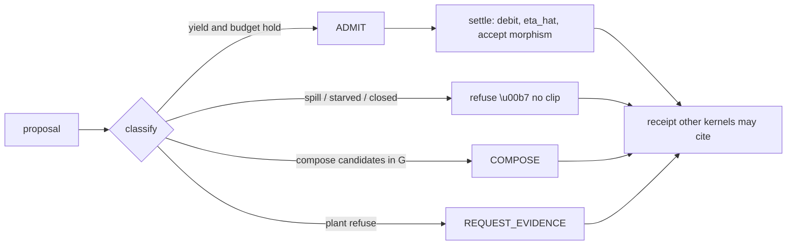

# Yield-Weighted Inference Runtime

A computational runtime for admitting or refusing token bursts on a
declared department budget, so spend buys reusable structure rather
than horizontal spill.

Short name **YWIR**. The reusable library import is `ywir`.

This is not a prompt-engineering kit and not a model router.
World-claims stay in
[Construction-State-Estimator-for-BIM](https://github.com/giasonpooni/Construction-State-Estimator-for-BIM),
[Parameterized-Lyapunov-Stability-Runtime](https://github.com/giasonpooni/Parameterized-Lyapunov-Stability-Runtime),
[Jacobian-Sensitivity-Propagation-Testbed](https://github.com/giasonpooni/Jacobian-Sensitivity-Propagation-Testbed),
and the token-gated mill servers. This repository owns the
**admission law**.

**In development.** Result files are development samples. They do not
confirm the runtime is out of development. See
[docs/DEVELOPMENT.md](docs/DEVELOPMENT.md).

The central question is:

> Given a proposer loop and declared observations, does the next
> burst raise rank, glue, or emit a morphism — or is it gauge?

## Map



Caption: tokens are control. Structure is what survives glue. A
yield receipt does not ACCEPT a building or a V.

## What is in the first slice

| Responsibility | What the runtime demonstrates |
| --- | --- |
| Department budget | `ledger`, `evidence`, `exploration`, `gauge`. |
| Letters | `ADMIT`, `COMPOSE`, `REQUEST_EVIDENCE`, `REINDEX`, `CLOSE_BUDGET`. |
| Spill taxonomy | Rank-flat, gauge similarity, unglued settlement, meta-precision. |
| Composition store | Caller-declared morphisms; compose instead of reprint. |
| Receipts | Citeable, non-owning. `does_not_claim` is frozen. |

Similarity, rank-delta, and glue are declared observations. This
package does not embed text and does not run a judge model.

## Install and run

Python 3.12 or 3.13. [uv](https://docs.astral.sh/uv/) is the
supported runner; a plain virtual environment also works.

```bash
git clone https://github.com/giasonpooni/Yield-Weighted-Inference-Runtime.git
cd Yield-Weighted-Inference-Runtime
uv run --python 3.13 python examples/quickstart.py
uv run --python 3.13 python examples/mill_token_gate.py
uv run --python 3.13 --with pytest pytest -q
```

Without uv:

```bash
python3 -m venv .venv
source .venv/bin/activate
pip install -e . pytest
PYTHONPATH=src python examples/quickstart.py
PYTHONPATH=src pytest -q
```

The quickstart writes `results/quickstart.md`.

## Role next to CSE, PLSR, JSPT, and CNC

JSPT emits `A`. PLSR returns a verdict on `V`. CSE may cite that
receipt. CNC token-gates motion on a mill. YWIR emits a verdict on
*spend*. CSE still cannot ACCEPT a clearance from a yield receipt.
YWIR still cannot ACCEPT a world-state from a low token count.

This package does not import those kernels.

See [docs/KERNEL.md](docs/KERNEL.md).

## Scope and limits

Admission on explicit department budgets and declared observations.
No embeddings, no cascade router, no energy accounting as the
objective, no Lyapunov V on the budget dynamics.

See [docs/SCOPE.md](docs/SCOPE.md), [docs/METHODS.md](docs/METHODS.md),
and [docs/DEVELOPMENT.md](docs/DEVELOPMENT.md).

## License

MIT. See [LICENSE](LICENSE).
